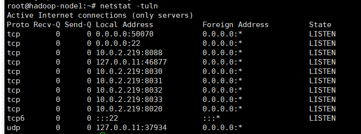
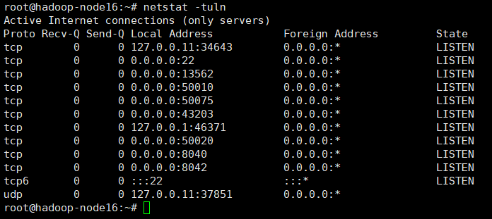

# hadoop容器集群性能测试
### overlay mode
在swarm集群创建一个hadoop-net overlay 网络

```shell
docker network create -d overlay hadoop-net
```

在node1创建一个master节点：
注意挂载数据到用户空间的文件夹下
```shell
    docker service create \
    --network hadoop-net \
    --name hadoop-node1 \
    --hostname=hadoop-node1 \
    --detach \
    --mount type=bind,source=/home/wangyuanbo/hdfs,target=/root/hdfs \
    --constraint node.hostname==node1  \
    hadoop:debug4  --master
```

在node16上创建一个slave节点：
```shell
    docker service create \
    --network hadoop-net \
    --name hadoop-node16 \
    --hostname=hadoop-node16 \
    --detach \
    --mount type=bind,source=/home/wangyuanbo/hdfs,target=/root/hdfs \
    --constraint node.hostname==node16  \
    hadoop:debug2  --slave --master-ip=hadoop-node1
```

创建完成后，加入master节点的bash环境，执行Hadoop示例文件
```shell
./example_benchmark.sh
```
这个示例文件的源码如下
```shell
#!/bin/bash
# 使用这个脚本的时候必须保证输出文件不存在，否则会报错
# 必须保证输出文件夹下“etc/hadoop”全都是文件，没有子文件夹

# 上传文件到hdfs
$HADOOP_HOME/bin/hdfs dfs -mkdir -p /user/root
$HADOOP_HOME/bin/hdfs dfs -put $HADOOP_HOME/etc/hadoop input

# 执行示例程序，这里是搜索input目录下文件的以‘dfs’开头的字符串数量，这个搜索目标以正则式给出
$HADOOP_HOME/bin/hadoop jar \
$HADOOP_HOME/share/hadoop/mapreduce/hadoop-mapreduce-examples-${HADOOP_VERSION}.jar \
grep input output 'dfs[a-z.]+'

# cat命令输出output
$HADOOP_HOME/bin/hdfs dfs -cat output/*
```
### 关闭master节点的服务
```shell
$HADOOP_HOME/sbin/yarn-daemon.sh stop resourcemanager
$HADOOP_HOME/sbin/hadoop-daemon.sh stop namenode
```

### 配置成功后master节点的网络端口情况

### 配置成功后slave节点的网络端口情况



## 遇到的坑
容器的存储空间满了，名字节点无法像数据节点拷贝数据

```shell
# 显示容器的存储空间,输出如下
docker system df
```

| TYPE          | TOTAL | ACTIVE | SIZE    | RECLAIMABLE |
| ------------- | ----- | ------ | ------- | ----------- |
| Images        | 15    | 10     | 10.19GB | 4.705GB (46%) |
| Containers    | 10    | 3      | 2.583GB | 2.582GB (99%) |
| Local Volumes | 1     | 1      | 3.532GB | 0B (0%)     |
| Build Cache   | 62    | 0      | 280.5MB | 280.5MB     |

- Images： 
  - 这部分显示的存储空间是所有Docker镜像文件的大小总和。
  在你的例子中，你有的15个镜像文件总大小为10.19GB。
- Containers： 
  - 这部分显示的存储空间是所有Docker容器的大小总和。
  容器使用的存储包括基于镜像运行的文件系统中所有文件的修改（包括删除、更改和添加新文件）。
  在你的例子中，你有的10个容器占用的总空间为2.583GB。
- Local Volumes： 
  - 这部分显示的存储空间是所有Docker卷的大小总和。
  卷是Docker的一种数据持久化机制，通常用来存储和共享容器的数据。
  在你的例子中，你有的1个卷占用的总空间为3.532GB。
- Build Cache： 
  - 这部分显示的存储空间是所有Docker构建缓存的大小总和。
  构建缓存存储的是在构建镜像时，由于每一步操作所产生的临时层文件。
  在你的例子中，你有的62个构建缓存占用的总空间为280.5MB。
  
解决方案：

清空所有暂时没有使用的容器，这只是一个暂时的解决方案。
如果想永久解决，需要将docker的默认存储路径/var/lib/docker修改到一个更大的地方。
然后编辑Docker daemon的配置文件 /etc/docker/daemon.json，
添加 {"data-root": "/new/path"}，然后重启Docker服务。
```shell
docker system prune
```


### This is the third title
- list content1
- list content2
- list content3

1. list content1
2. list content2
3. list content3

[这是一个链接](https://example.com)


*斜体字*

**粗体字**


_斜体字_

**粗体字**

- code:
  - ``print("hello world!")``